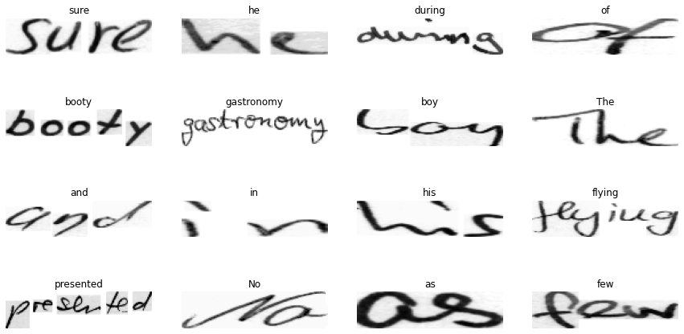
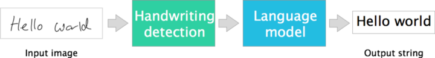
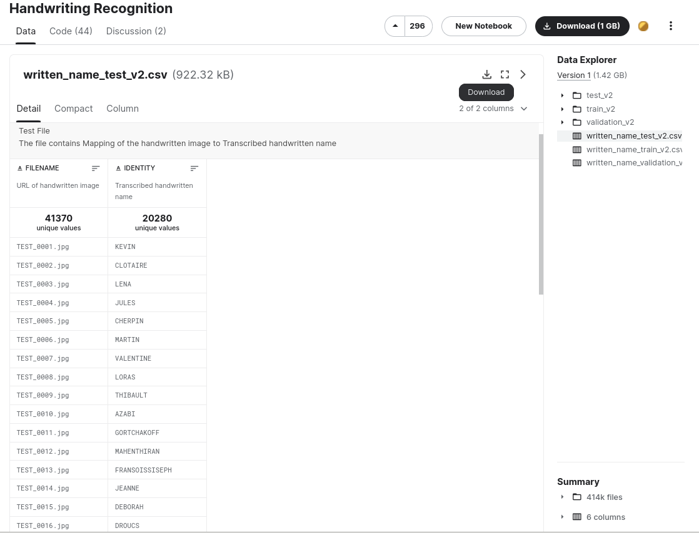
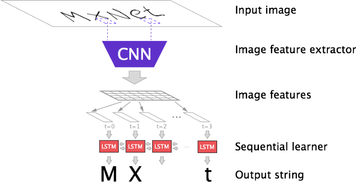

# Project Title: Object Recognition!

## Abstract

To create a model which correctly identifies an object within given data i.e. image/scene. 
I will be using my selected data set to try to recoginise the hand-written names, letter by letter, and then combine them together to form the digitised text.

## Detailed Description

I will use batches of the images of the hand-written names to train the CNN and the classification models by updating the parameters after each epoch, in order for the model to recognise the text and be able to display a digitised version(s) of these names found in our dataset. Additionally, based on the success rate of my model, I will try to add to the dataset by introducing a number of new samples, representing names which aren't included in the dataset; in my own hand writing.

If the model struggles with recognition, I will train the model to recognise each letter of the alphabet, both in lowercase and uppercase forms, by creating a small dataset with my own hand written sample-set. If my model recognises these names successfully, and produces their digitised versions with an accuracy rate of 50%, I will consider this as a successful model for Object Recognition.

### Datasets
**Datasets Introduction:** The dataset I will be using for my handwriting recognition project contains 413,823 samples of handwritten names, consisting of both surnames and given names. These are split with 207,024 surnames and the remaining 206,799 being given names, all hand-written and scanned into this data set. 

**Train & Test Samples:** This dataset has already been split into three parts, with 80% allocated to training, and 10% each towards testing and validation purposes; this should serve my process well. 

**Challenges:** Due to the size of the Dataset zip folder of almost 1.5GB, it has been diffult to preview the quality and consistancy of the dataset, however based on the advisory, a small part of the dataset has repeat data, and I am also concious that not all the data will be suited for training this model.

### Arcitecture Proposal

**I)**   Firstly, I will set the value to the conventional kernels.

**II)**  Then we will be passing the images containing the handwriting through the kernels, in order to convolute these images. 

**III)** Once we've convoluted these images, we can pool the images and then activate them. 
         (We can repeat the second and third steps until we get the desired effect)

**IV)**  Then this will result in many images which represent partial features from the originally input images. 

**V)**   The final images will now be laid out in order to generate our input layer of the fully-connected NN, and based off of this,
         we will classify the batch of images.

**VI)**  We will then segmentate the letters and then try to find the edges for each letter individually.

**VII)** In order to minimise the value of the cost funtion, we will update the value of the weight parameters after each trainng batch,
         until the accuracy reaches convergence.

**VIII)** This should result in a fine trained model which will successfully classify our text, including both lower-case and upper-case letters,
          and combine this to recognise the names, and then produce them digitally. 

## References

Data set - https://www.kaggle.com/datasets/landlord/handwriting-recognition?resource=download

https://arxiv.org/pdf/2104.11892.pdf

Jonathan Chung. Handwriting recognition and language modeling with MXNet Gluon. https://medium.com/apache-mxnet/handwriting-ocr-handwriting-recognition-and-language-modeling-with-mxnet-gluon-4c7165788c67

Liu, Li, et al. “Deep Learning for Generic Object Detection: A Survey.” International Journal of Computer Vision, vol. 128, no. 2, Feb. 2020, pp. 261–318. Springer Link, https://doi.org/10.1007/s11263-019-01247-4.

Zaidi, Syed Sahil Abbas, et al. A Survey of Modern Deep Learning Based Object Detection Models. arXiv, 12 May 2021. arXiv.org, https://doi.org/10.48550/arXiv.2104.11892.

